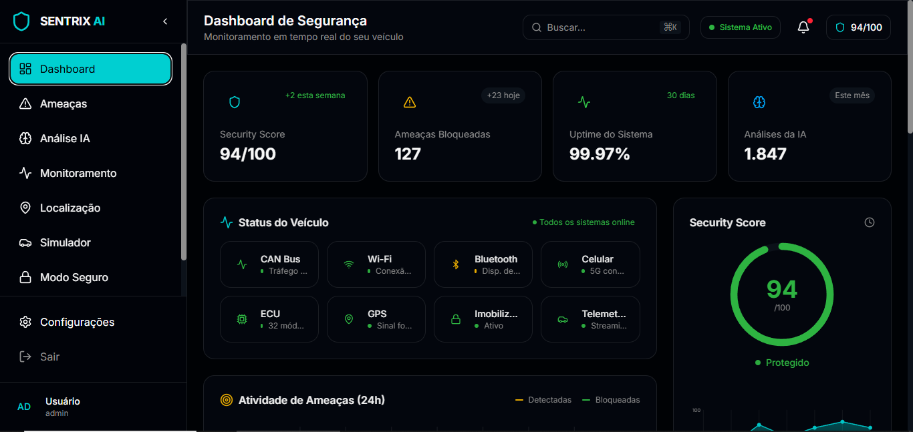
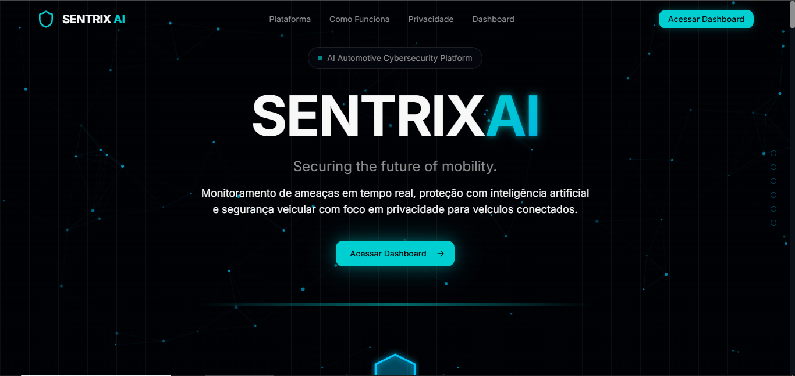
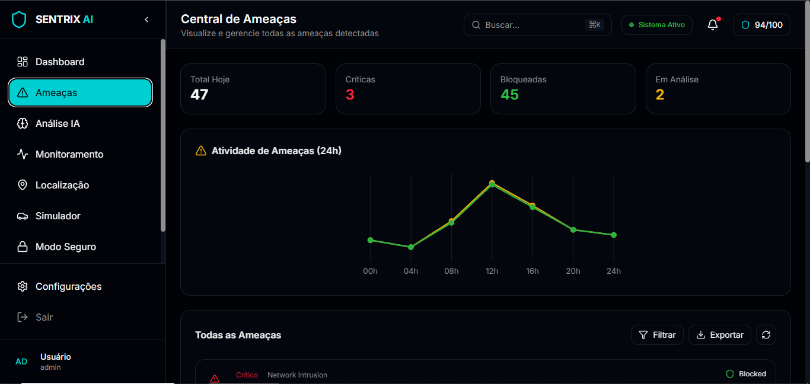
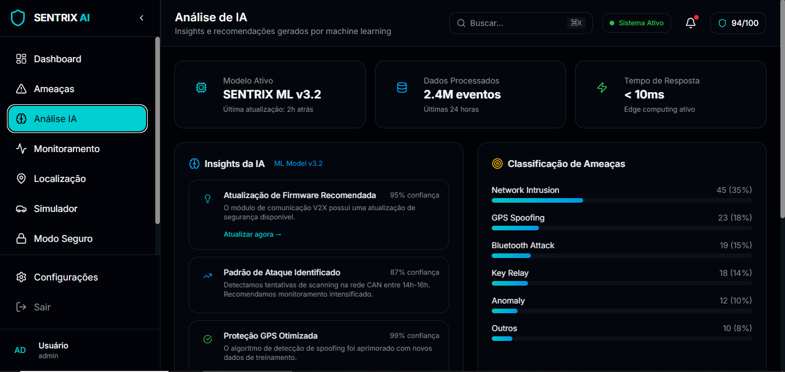

[README (2).md](https://github.com/user-attachments/files/30025051/README.2.md)
<div align="center">

# 🛡️ SENTRIX AI

### Securing the Future of Mobility

**An AI-powered concept platform for automotive cybersecurity, built as the capstone project for the Ford Enter program.**

[](https://sentrix-ai-taupe.vercel.app/)
[](https://angular.io/)
[](https://www.typescriptlang.org/)
[](#-license)
[]()

[**🚀 Live Demo**](https://sentrix-ai-taupe.vercel.app/) · [**📖 Documentation**](#-table-of-contents) · [**🐛 Report an Issue**](https://github.com/jtteix/SentrixAI_ProjetoFinal/issues) · [**💡 Request a Feature**](https://github.com/jtteix/SentrixAI_ProjetoFinal/issues)

<br>



</div>

<br>

---

## 📋 Table of Contents

- [About the Project](#-about-the-project)
- [The Problem](#-the-problem)
- [The Solution](#-the-solution)
- [Product Preview](#-product-preview)
- [Research References — Real-World Cases](#-research-references--real-world-cases)
- [System Architecture](#-system-architecture)
- [User Flow](#-user-flow)
- [Tech Stack](#-tech-stack)
- [Folder Structure](#-folder-structure)
- [Features](#-features)
- [Design System](#-design-system)
- [Design Inspiration](#-design-inspiration)
- [Applied Concepts](#-applied-concepts)
- [Getting Started](#-getting-started)
- [Available Scripts](#-available-scripts)
- [Roadmap](#-roadmap)
- [Objectives](#-objectives)
- [Contributing](#-contributing)
- [License](#-license)
- [Author](#-author)
- [Acknowledgments](#-acknowledgments)

<br>

---

## 🚗 About the Project

**SENTRIX AI** is a front-end concept platform that simulates how artificial intelligence could be used to detect, analyze, and respond to cybersecurity threats in **connected and autonomous vehicles**.

The project was designed and developed as the **final capstone project of the Ford Enter program**, with the goal of demonstrating hands-on proficiency in Angular, TypeScript, component-based architecture, responsive design, UX/UI, agile methodologies, and data-privacy principles (LGPD).

> ⚠️ **Disclaimer:** SENTRIX AI is a **conceptual, front-end-only application**. There is no real backend, no real vehicle telemetry, and no actual threat-detection engine. All data, alerts, AI insights, and vehicle metrics displayed in the platform are **simulated** for demonstration and educational purposes.

<br>

| | |
|---|---|
| 🎯 **Type** | Front-end concept / capstone project |
| 🏫 **Program** | Ford Enter |
| 🧠 **Focus** | Automotive Cybersecurity + AI (simulated) |
| 🖥️ **Backend** | None — 100% front-end application |
| 🌐 **Live Demo** | [sentrix-ai-taupe.vercel.app](https://sentrix-ai-taupe.vercel.app/) |

<br>

---

## ⚠️ The Problem

Modern vehicles are no longer just mechanical machines — they are **computers on wheels**.

A single connected car today can rely on:

- 🤖 Embedded Artificial Intelligence
- ☁️ Cloud Computing & remote APIs
- 📡 OTA (Over-the-Air) Updates
- 🔗 V2X Communication (Vehicle-to-Everything)
- 📶 Bluetooth, Wi-Fi & 5G connectivity
- 🛰️ GPS & real-time location services
- 🧩 Dozens of interconnected sensors
- ⚡ Edge Computing units

Every one of these entry points is also a potential **attack surface**. As connectivity increases, so does exposure to remote exploitation, data theft, unauthorized access, and even physical safety risks for drivers and passengers.

The automotive industry has already seen real, documented incidents that prove this is not a hypothetical concern — it is an active and evolving battlefield (see [Research References](#-research-references--real-world-cases) below).

<br>

---

## 💡 The Solution

**SENTRIX AI** proposes a centralized security cockpit for connected vehicles — a dashboard where AI-driven monitoring would continuously:

1. **Detect** anomalous behavior across vehicle systems (network, sensors, APIs, keyless entry).
2. **Score** the vehicle's real-time security posture.
3. **Alert** the driver/owner about active or potential threats.
4. **Explain** each threat in plain language, powered by simulated AI analysis.
5. **Respond** with protective actions, including a dedicated **Safe Mode**.
6. **Protect** user privacy and personal data in compliance with LGPD principles.

The result is a product experience that feels less like a technical security tool and more like a **trusted co-pilot for digital safety** — inspired by the clarity of consumer products like Stripe, Apple, and Tesla.

<br>

---

## 🖼️ Product Preview

<div align="center">

**Landing Page**


**Dashboard de Segurança**


**Central de Ameaças**


**Análise de IA**


</div>

<!-- GIF PLACEHOLDER -->
<div align="center">
  
  <p><em>Full walkthrough — from Landing Page to AI Analysis</em></p>
</div>

<br>

---

## 🔬 Research References — Real-World Cases

SENTRIX AI's concept and features were inspired by publicly documented automotive cybersecurity research. Below is a brief, factual summary of each case.

<details open>
<summary><strong>🚙 Jeep Cherokee Hack (2015)</strong></summary>
<br>

Security researchers Charlie Miller and Chris Valasek demonstrated a remote exploit against a Jeep Cherokee's Uconnect infotainment system, gaining access over the cellular network and ultimately manipulating the vehicle's steering, brakes, and transmission while it was being driven. The disclosure led Fiat Chrysler to recall approximately 1.4 million vehicles to patch the vulnerability. It remains one of the most cited case studies in automotive cybersecurity.

</details>

<details>
<summary><strong>🔋 Tesla Security Research</strong></summary>
<br>

Tesla has been a frequent subject of independent security research, including participation in events like Pwn2Own, where researchers have been rewarded for identifying vulnerabilities in its infotainment and software stack. Tesla also maintains a public bug bounty program, reflecting an industry shift toward proactive vulnerability disclosure in connected vehicles.

</details>

<details>
<summary><strong>📶 Tesla Bluetooth Vulnerabilities</strong></summary>
<br>

Independent researchers have demonstrated relay-style attacks against Bluetooth Low Energy (BLE) based "Phone-as-a-Key" systems, including Tesla's, showing that signals from a legitimate key/phone could be relayed to unlock and start a vehicle even when the real key was out of range. These findings highlighted broader weaknesses in proximity-based authentication.

</details>

<details>
<summary><strong>🔑 Keyless Relay Attacks</strong></summary>
<br>

Keyless entry relay attacks are a well-documented technique in which two attackers use signal-relay devices to extend the range of a key fob's signal — one near the key, one near the car — tricking the vehicle into thinking the key is nearby. This attack class affects many manufacturers using passive keyless entry systems and has been linked to real-world vehicle thefts.

</details>

<details>
<summary><strong>🍃 Nissan Leaf Vulnerabilities</strong></summary>
<br>

In 2016, security researcher Troy Hunt disclosed that the Nissan Leaf's companion mobile app communicated with an API that lacked proper authentication. As a result, anyone who knew a vehicle's VIN could potentially access climate control functions and view driving history data for that specific car — illustrating the risks of poorly secured connected-vehicle APIs.

</details>

<details>
<summary><strong>🌐 Connected Vehicle APIs</strong></summary>
<br>

Broader industry research (including widely reported work by security researcher Sam Curry and collaborators in 2022) uncovered vulnerabilities across the backend APIs of multiple major automakers, which in some cases could have allowed remote access to vehicle functions or exposure of customer data. These findings underscored that vehicle security extends well beyond the car itself, into the cloud infrastructure and APIs that support it.

</details>

<details>
<summary><strong>🚌 CAN Bus Attacks</strong></summary>
<br>

The Controller Area Network (CAN bus) is the internal communication backbone connecting a vehicle's electronic control units (ECUs). By design, it was not built with authentication or encryption, meaning that a device with access to the bus can inject messages to influence critical systems. Academic research (notably Koscher et al., 2010) and the Jeep Cherokee case both demonstrated how CAN bus weaknesses can be leveraged once an attacker gains a foothold in the vehicle's network.

</details>

<br>

---

## 🏗️ System Architecture

SENTRIX AI is a **single-page application (SPA)** built entirely on the front end. There is no server, database, or real API — all "AI" responses, threat feeds, and vehicle telemetry are mocked/simulated within the Angular application to recreate a realistic product experience.

```
┌─────────────────────────────────────────────────────────┐
│                     SENTRIX AI (SPA)                     │
│                                                           │
│   ┌───────────┐   ┌───────────┐   ┌──────────────────┐   │
│   │  Angular   │   │  Angular  │   │   Simulated Data   │   │
│   │  Router    │──▶│ Components│──▶│  & Mock AI Engine  │   │
│   └───────────┘   └───────────┘   └──────────────────┘   │
│                                                           │
│   ┌────────────────────────────────────────────────┐     │
│   │           Shared Services (RxJS Streams)         │     │
│   │   Auth (mock) · Threats · Vehicle · Privacy       │     │
│   └────────────────────────────────────────────────┘     │
└─────────────────────────────────────────────────────────┘
                          │
                          ▼
                 Deployed on Vercel
        https://sentrix-ai-taupe.vercel.app/
```

<br>

---

## 🧭 User Flow

```
   Landing Page
        │
        ▼
      Login ──────────┐
        │              │
        ▼              ▼
    Cadastro       (existing user)
        │              │
        └──────┬───────┘
               ▼
           Dashboard
               │
   ┌─────┬─────┼─────┬─────────┬───────────┬─────────────┐
   ▼     ▼     ▼     ▼         ▼           ▼             ▼
Ameaças  IA  Monitor  GPS   Simulador  Modo Seguro   Configurações
(Threat (AI  amento (Locali-  (Attack   (Safe Mode)     (Settings)
Center) Anal.)         zação)  Simulator)
```

<br>

---

## 🛠️ Tech Stack

| Category | Technology |
|---|---|
| **Framework** | [Angular](https://angular.io/) |
| **Language** | [TypeScript](https://www.typescriptlang.org/) |
| **Markup** | HTML5 (semantic) |
| **Styling** | CSS3 (responsive, mobile-first) |
| **Routing** | Angular Router |
| **Reactive State** | RxJS |
| **Version Control** | Git & GitHub |
| **Deployment** | Vercel |
| **Compliance** | LGPD-aware data handling (conceptual) |

<br>

---

## 📁 Folder Structure

```
sentrix-ai/
├── src/
│   ├── app/
│   │   ├── core/                 # Singleton services, guards, interceptors
│   │   │   ├── services/
│   │   │   └── guards/
│   │   ├── shared/                # Reusable components, pipes, directives
│   │   │   ├── components/
│   │   │   └── pipes/
│   │   ├── features/
│   │   │   ├── landing/           # Landing page (hero, storytelling, CTA)
│   │   │   ├── auth/              # Login & Cadastro
│   │   │   ├── dashboard/         # Main overview dashboard
│   │   │   ├── threat-center/     # "Ameaças" — threat monitoring module
│   │   │   ├── ai-analysis/       # "Análise IA" — simulated ML insights
│   │   │   ├── monitoring/        # "Monitoramento" — live subsystem monitoring
│   │   │   ├── location/          # "Localização" — GPS tracking & spoofing detection
│   │   │   ├── simulator/         # "Simulador" — attack simulation module
│   │   │   ├── safe-mode/         # "Modo Seguro" — emergency/safe mode module
│   │   │   └── settings/          # "Configurações" — user & vehicle settings
│   │   ├── app-routing.module.ts
│   │   └── app.module.ts
│   ├── assets/
│   │   ├── images/
│   │   └── icons/
│   ├── styles/                    # Global styles & design tokens
│   └── environments/
├── docs/
│   └── assets/                    # README screenshots & GIFs
├── angular.json
├── package.json
├── tsconfig.json
└── README.md
```

<br>

---

## ✨ Features

### 🏠 Landing Page
- [x] Glowing hero section with animated network background
- [x] Clear navigation — Plataforma, Como Funciona, Privacidade, Dashboard
- [x] Product storytelling ("Securing the future of mobility")
- [x] Real-world case highlights
- [x] Technology showcase
- [x] Prominent "Acessar Dashboard" call-to-action

### 🔐 Authentication
- [x] Login
- [x] Cadastro (sign-up)

### 📊 Dashboard
- [x] Real-time **Security Score** ring (e.g. `94/100`)
- [x] Key metrics at a glance — threats blocked, system uptime, AI analyses run
- [x] **Vehicle Status** grid: CAN Bus, Wi-Fi, Bluetooth, 5G Cellular, ECU (32 modules), GPS, Immobilizer, Telemetry
- [x] 24h threat activity chart (detected vs. blocked)
- [x] Quick-access navigation to all modules

### 🚨 Ameaças (Threat Center)
- [x] Daily threat summary — total, critical, blocked, under analysis
- [x] 24h threat activity timeline
- [x] Full threat table with severity badges (Critical / Blocked / etc.)
- [x] Filter and export threat logs

### 🧠 Análise IA (AI Analysis)
- [x] Live ML model status (**SENTRIX ML v3.2**) with last-update timestamp
- [x] Processing metrics — events analyzed (24h) and response latency (edge computing)
- [x] AI-generated insights with confidence score (e.g. firmware update recommendations, attack pattern detection)
- [x] Threat classification breakdown — Network Intrusion, GPS Spoofing, Bluetooth Attack, Key Relay, Anomaly, and more

### 📡 Monitoramento (Monitoring)
- [x] Continuous, real-time monitoring of vehicle subsystems

### 📍 Localização (Location)
- [x] Live GPS tracking and location-based anomaly detection (e.g. GPS spoofing alerts)

### 🎮 Simulador (Attack Simulator)
- [x] Simulate attack scenarios to visualize how SENTRIX AI would detect and respond

### 🛟 Modo Seguro (Safe Mode)
- [x] One-click protective response simulation

### ⚙️ Configurações (Settings)
- [x] User preferences
- [x] Vehicle configuration

<br>

---

## 🎨 Design System

| Token | Description |
|---|---|
| **Color Palette** | Dark, high-contrast base with a signature security-blue/cyan accent |
| **Typography** | Clean, geometric sans-serif for a technical yet approachable feel |
| **Spacing** | 8px baseline grid |
| **Components** | Fully componentized (buttons, cards, badges, modals, alerts) |
| **Responsiveness** | Mobile-first, breakpoints for tablet & desktop |
| **Motion** | Subtle transitions to reinforce a sense of real-time monitoring |

<br>

---

## 🖌️ Design Inspiration

The visual language and UX of SENTRIX AI were shaped by studying the interface conventions of category-defining tech products — used purely as references for interaction patterns, information hierarchy, and visual polish (not copied):

- **Stripe** — clarity, precision, and confident use of whitespace
- **Apple** — minimalism and product storytelling
- **Tesla** — dark, futuristic dashboards for real-time data
- **Linear** — crisp micro-interactions and modern UI density
- **Palantir** — data-dense, mission-critical interface aesthetics

<br>

---

## 📚 Applied Concepts

This project was built to demonstrate applied proficiency in:

- ✅ Angular architecture (modules, components, services, routing)
- ✅ TypeScript & strong typing
- ✅ Component-based UI design
- ✅ Responsive, mobile-first layout
- ✅ Git & GitHub workflow (branches, commits, PRs)
- ✅ Agile methodologies (sprints, backlog, iterative delivery)
- ✅ UX/UI design principles
- ✅ Data privacy awareness (LGPD)
- ✅ Technical documentation & product storytelling

<br>

---

## 🚀 Getting Started

### Prerequisites

- [Node.js](https://nodejs.org/) (LTS recommended)
- [Angular CLI](https://angular.io/cli)

```bash
npm install -g @angular/cli
```

### Installation

```bash
# 1. Clone the repository
git clone https://github.com/jtteix/SentrixAI_ProjetoFinal.git

# 2. Enter the project folder
cd SentrixAI_ProjetoFinal

# 3. Install dependencies
npm install

# 4. Run the development server
ng serve
```

The application will be available at `http://localhost:4200/`.

<br>

---

## 📜 Available Scripts

| Command | Description |
|---|---|
| `ng serve` | Runs the app in development mode |
| `ng build` | Builds the app for production |
| `ng test` | Runs unit tests |
| `ng lint` | Lints the codebase |

<br>

---

## 🗺️ Roadmap

- [x] Landing Page
- [x] Login / Cadastro flow
- [x] Dashboard
- [x] Threat Center
- [x] AI Analysis module
- [x] Monitoramento (real-time monitoring)
- [x] Localização (GPS tracking)
- [x] Simulador (attack simulator)
- [x] Modo Seguro (Safe Mode)
- [x] Configurações (Settings)
- [ ] Dedicated LGPD Privacy Center module
- [ ] Full accessibility (WCAG) audit
- [ ] Internationalization (PT-BR / EN)
- [ ] Dark/Light theme toggle
- [ ] Integration with a real mock API layer (JSON Server)
- [ ] Unit & E2E test coverage expansion

<br>

---

## 🎯 Objectives

- Demonstrate applied, production-style front-end engineering skills using Angular
- Present a convincing, realistic product narrative around automotive cybersecurity
- Ground the concept in real, documented industry research rather than speculation
- Deliver a polished UX/UI comparable to modern SaaS and mobility products
- Serve as a portfolio-grade capstone project for the Ford Enter program, SENAI CIMATEC, and Rede Cidadã

<br>

---

## 🤝 Contributing

This is an academic capstone project, but suggestions and feedback are welcome.

1. Fork the repository
2. Create your feature branch (`git checkout -b feature/amazing-feature`)
3. Commit your changes (`git commit -m 'Add some amazing feature'`)
4. Push to the branch (`git push origin feature/amazing-feature`)
5. Open a Pull Request

<br>

---

## 📄 License

This project is licensed under the **MIT License** — see the [LICENSE](./LICENSE) file for details.

<br>

---

## 👤 Author

**Your Name**

- GitHub: [@jtteix](https://github.com/jtteix)
- LinkedIn: [linkedin.com/in/jtteix](https://www.linkedin.com/in/jtteix/)
- Live Project: [sentrix-ai-taupe.vercel.app](https://sentrix-ai-taupe.vercel.app/)

<br>

---

## 🙏 Acknowledgments

- **Ford Enter** — for the program and challenge that inspired this project
- **SENAI CIMATEC** — for technical mentorship and infrastructure
- **Rede Cidadã** — for program support and opportunity
- The security researchers whose public work is referenced in the [Research References](#-research-references--real-world-cases) section

<br>

<div align="center">

**SENTRIX AI** — *Securing the Future of Mobility* 🛡️🚗

Made with ❤️ and Angular.

</div>
